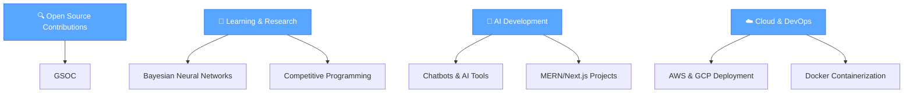

# Hi, I'm Arbaz Ahmed 👋

  

<h2 align="center">
  
</h2>

  

## 🚀 Featured Projects

| Project | Description | Tech Stack |
|---------|-------------|------------|
| 🎥 **Anime Explorer** | Blazing fast anime streaming platform | Next.js, HLS, SSR |
| 💬 **Chat App** | Real-time messaging application | Socket.io, MERN |
| 🔍 **Lost & Found** | Real-time lost item tracking platform | React, Node.js |
| 📚 **Library Management** | Payment + WhatsApp integration | Razorpay, WhatsApp API |
| 🎭 **Event Management** | One-stop event organizer | MERN Stack |
| 📝 **Blog Platform** | Role-based publishing tools | Next.js, Prisma |
| ✂️ **AI Background Remover** | AI-powered image processing | Python, Stripe |
| 🤖 **Gemini AI Bot** | Intelligent chatbot | MERN, Gemini API |
| 📈 **Investment Marketplace** | Real-time investment analysis | React, WebSocket |
| 🧠 **AI Career Coach** | Career guidance system | Next.js, Prisma |
| 💬 **Virtual Assistant** | Smart Q&A bot | AI, NLP |
| 🏆 **Gamified Habit Tracker** | Hackathon-winning productivity tool | Mern Stack |

## 💡 Skills & Tech Stack

### 🎨 Frontend Development

  

### ⚙️ Backend Development

  

### 🗄️ Databases & Cloud

  

### 🛠️ Tools & Development

  

## 🎯 Current Focus

- 🔍 **Open-source** & **Hacktoberfest contributions**  
- 📖 Exploring **Bayesian Neural Networks** & **competitive programming**  
- 🤖 Building **chatbots & AI tools** using **MERN/Next.js**
- 🚀 Developing **full-stack applications** with modern tech stacks
- ☁️ Learning **cloud deployment** with **AWS**, **GCP**, and **Docker**

## ✨ Fun Facts About Me

  

- 🔥 Solve coding challenges in **C++** & explore **AI with Python**  
- ⚛️ Build modern web apps with **React**, **Next.js**, and **TypeScript**
- ☁️ Deploy applications using **Docker**, **AWS**, and **GCP**
- ✈️ Build tools to improve **productivity** and **decision-making**  
- 🧑‍💻 Currently working as a **freelance developer**
- 🎯 Always learning new technologies and best practices

## 🌐 Let's Connect & Collaborate!

  

    
    &nbsp;&nbsp;&nbsp;&nbsp;
    
    &nbsp;&nbsp;&nbsp;&nbsp;
    
    &nbsp;&nbsp;&nbsp;&nbsp;
    
  

  

---

  

  

